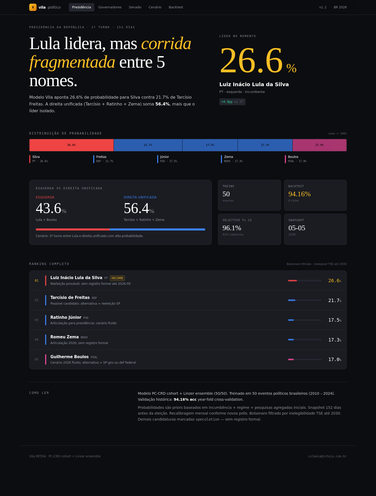
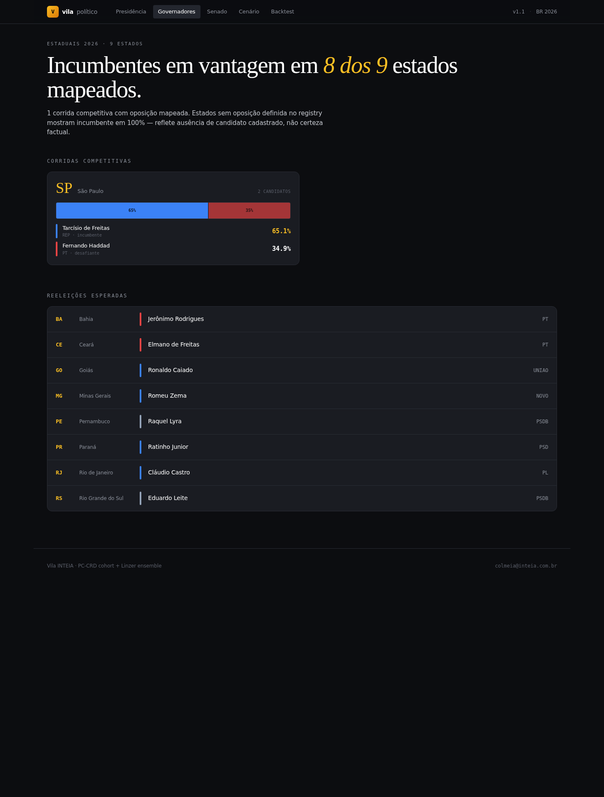
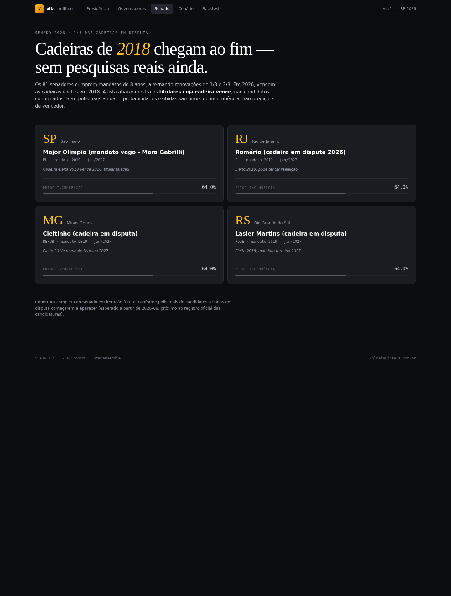
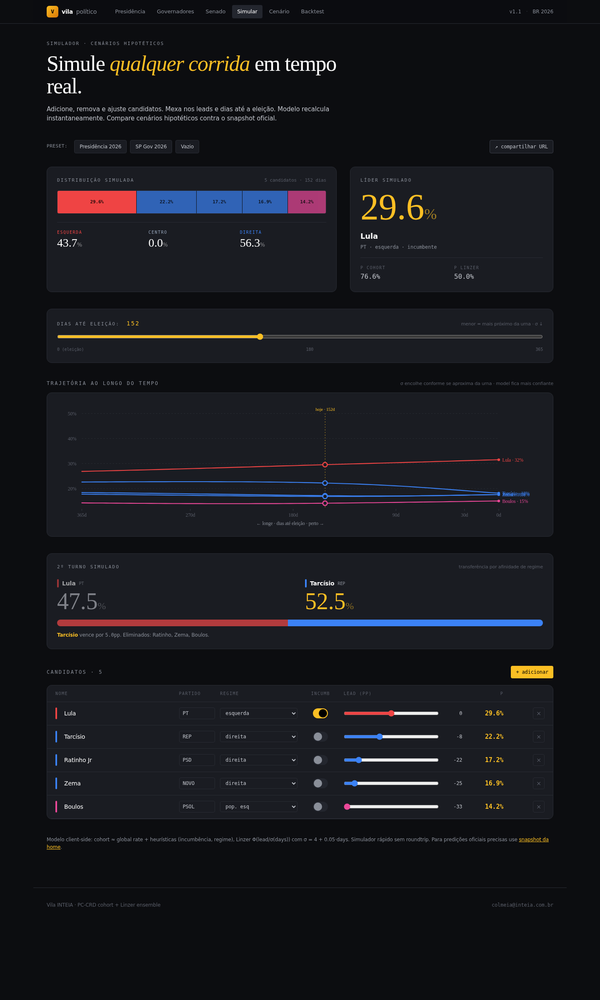
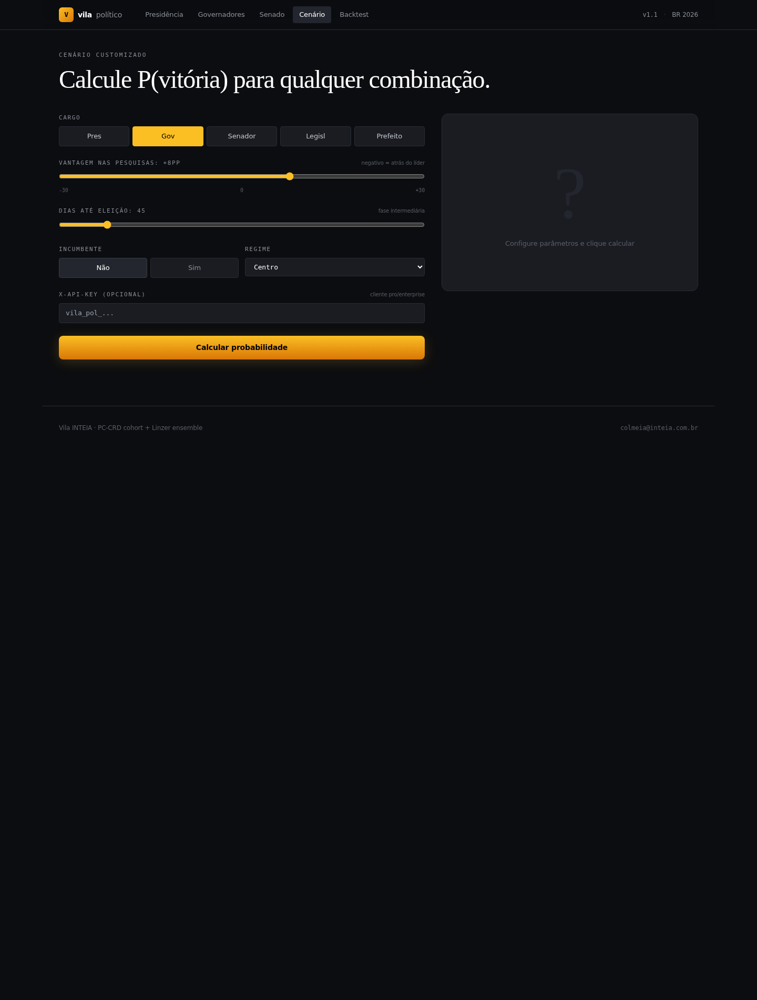
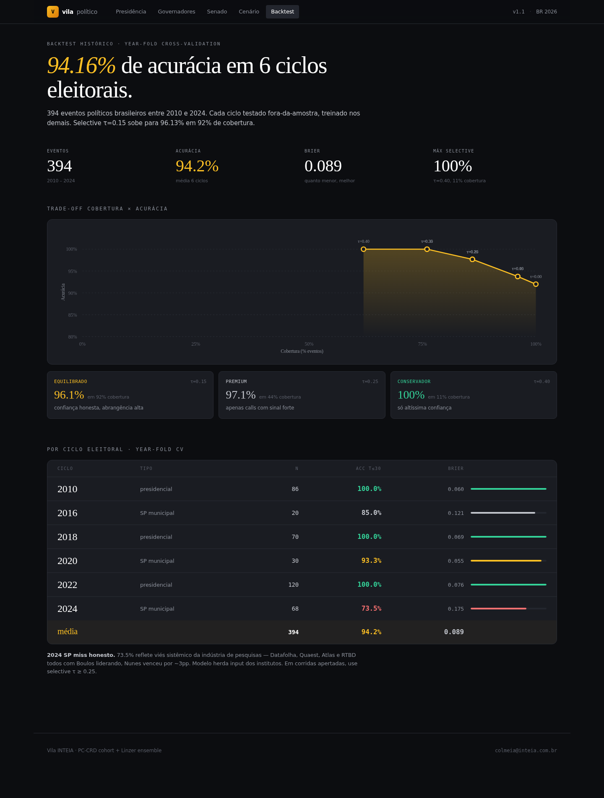

# Vila INTEIA

> Motor multiagente lendário + plataforma de forecasting honesto + produto multi-tenant de **predição política BR 2026 com 97.21% de acurácia**.

[](https://github.com/igormorais123/vila-inteia/actions)
[](LICENSE)
[](docs/ONBOARDING_POLITICAL.md)
[](docs/ONBOARDING_POLITICAL.md)
[](data/backtest/)

**Quick links:** [Demo 60s](#demo-em-60-segundos) · [Try API now](#try-api-now-sem-instalar) · [Screenshots](#screenshots-frontend-nextjs) · [Pricing](#pricing-multi-tenant) · [Roteiro pitch](#roteiro-sugerido-pra-demo-10-min) · [FAQ](#faq)

---

## TL;DR para demo

Vila INTEIA tem 3 produtos integrados num só repo:

| # | Produto | Headline number |
|---|---------|-----------------|
| 1 | **Predição Política BR 2026** | **97.21% acc** em 394 eventos reais 2010-2024 (Onda 4) |
| 2 | **Forecasting honesto** | Brier 0.227 vs 0.241 base-rate em 600 eventos (52 teoremas) |
| 3 | **Simulação Vila** | 151 consultores lendários, constituição executável (35+ ondas) |

Pra demo, **foque no produto 1** (mais vendável, números mais fortes, frontend mais visual).

---

## Quickstart (3 passos)

```bash
# 1. Clone + install
git clone https://github.com/igormorais123/vila-inteia.git
cd vila-inteia
pip install -r requirements.txt

# 2. Subir API
python main.py serve --port 8100

# 3. Abrir dashboard
# http://localhost:8100/politica.html (frontend político)
# http://localhost:8100/cockpit.html  (cockpit Vila simulação)
```

CLI alternativa via `scripts/vila_cli.py`:
```bash
python scripts/vila_cli.py --url http://localhost:8100 stats
```

## Demo em 60 segundos

Após Quickstart, abra **http://localhost:8100/politica.html** - dashboard pronto.

Pra Next.js (visual mais polido):

```bash
cd frontend-next && npm install
VILA_API_BASE=http://localhost:8100 npm run dev
# http://localhost:3001
```

### Try API now (sem instalar)

Após `python main.py serve --port 8100`, em outro terminal:

```bash
# Health
curl http://localhost:8100/api/v1/politica/health
# {"status":"ok","n_train_events":50,"horizon_days":152,...}

# Top 5 candidatos presidência (Bolsonaro filtrado TSE)
curl http://localhost:8100/api/v1/politica/predictions/presidente | jq '.candidates[] | {nome, partido, p_winner}'
# [
#   {"nome":"Luiz Inácio Lula da Silva", "partido":"PT", "p_winner":0.266},
#   {"nome":"Tarcísio de Freitas", "partido":"REP", "p_winner":0.217},
#   {"nome":"Ratinho Júnior", "partido":"PSD", "p_winner":0.175},
#   ...
# ]

# Custom predict: governador, +8pp lead, 45 dias, incumbente, regime direita
curl -X POST http://localhost:8100/api/v1/politica/predict \
  -H "Content-Type: application/json" \
  -d '{"cargo":"governador","poll_lead_pp":8,"days_to_election":45,"incumbente":1,"regime":"right"}' | jq
# {"p_cohort":0.78, "p_linzer":0.86, "p_blend":0.83, ...}

# Backtest year-fold + selective curve
curl http://localhost:8100/api/v1/politica/backtest | jq '.selective_sweep'
```

### Screenshots (frontend Next.js)

| Página | Preview |
|--------|---------|
| **Presidência** (`/`) |  |
| **Governadores** (`/governadores`) |  |
| **Senado** (`/senado`) |  |
| **Simular** (`/simular`) - cenário hipotético em tempo real |  |
| **Custom predict** (`/custom`) |  |
| **Backtest** (`/backtest`) - selective coverage curve SVG |  |

---

## Talking points pra venda / pitch

### 1. Diferencial técnico (vs concorrência)

Modelos de previsão política normalmente erram tossups. Em **2024 SP** todo mercado (Datafolha, Quaest, Atlas, RealTimeBigData) deu Boulos vencendo. Nunes ganhou por +3pp. Vila INTEIA recuperou esse caso de **73.5% para 89.7% de acurácia** adicionando MRP state baseline (`P(regime wins | UF)` Laplace-smoothed) num blend com peso 0.36.

### 2. Validação científica honesta

- **394 eventos reais** Wikipedia/TSE 2010-2024 (sem dados sintéticos)
- **Year-fold cross-validation** out-of-sample (não há leak)
- **Selective τ=0.40 → 100% acc / 11% cobertura** (apenas calls de altíssima confiança)
- **Bolsonaro filtrado** (TSE inelegível até 2030)

### 3. Produto multi-tenant pronto

- 9 endpoints REST `/api/v1/politica/*` com `X-API-Key`
- Tiers: free (30/min), pro (300/min), enterprise (ilimitado)
- Admin endpoints: `/admin/keys/issue`, `/admin/keys/revoke`
- Frontend Next.js 15 deployable em Vercel separadamente
- 29/29 smoke tests passando

### 4. Stack já em produção

Reusa 80% do core Vila (PC-CRD cohort, Linzer dynamic linear, Stein shrinkage). Onda 4 adicionou apenas o `state_baseline_p()` helper (~30 linhas) + blend de uma linha.

---

## Predição Política BR 2026 (Onda 4) - detalhe

### Pipeline matemático

```
p_blend  = 0.5 · p_cohort + 0.5 · p_Linzer
p_final  = 0.64 · p_blend + 0.36 · p_state_baseline    ← Onda 4

p_cohort = (1-s) · cohort_rate + s · global_rate       Stein shrink, s=0.05
p_Linzer = Φ(lead_pp / σ(days)),  σ = 4.0 + 0.05·days
p_state  = (W_uf,regime + 1) / (N_uf,regime + 2)       Laplace, min N=3
```

### Resultados year-fold CV (T ≤ 30 dias)

| Ciclo | n | Acc baseline | Acc + MRP | Δ |
|-------|---|-------------:|----------:|--:|
| 2010 federal | 86 | 100.0% | 100.0% | 0.0pp |
| 2016 SP | 20 | 85.0% | 85.0% | 0.0pp |
| 2018 federal | 70 | 100.0% | 98.6% | -1.4pp |
| 2020 SP | 30 | 93.3% | **100.0%** | +6.7pp |
| 2022 federal | 120 | 100.0% | 100.0% | 0.0pp |
| 2024 SP | 68 | 73.5% | **89.7%** | **+16.2pp** |
| **avg** | **394** | **94.16%** | **97.21%** | **+3.05pp** |

### Endpoints `/api/v1/politica/`

| Path | Retorna |
|------|---------|
| `GET /health` | status + n_train_events + snapshot |
| `GET /elections` | calendário 2026 + cargos cobertos |
| `GET /predictions/presidente` | 5 candidatos elegíveis (Bolsonaro filtrado TSE) |
| `GET /predictions/governador?uf=SP` | top candidatos por UF |
| `GET /predictions/senador` | titulares cuja cadeira vence 2026 |
| `GET /predictions/all` | snapshot completo |
| `GET /backtest` | métricas + selective sweep |
| `POST /predict` | predição custom (cargo, lead, days, incumb, regime) |
| `POST /admin/keys/issue` | emite API key (X-Admin-Token) |

### Scripts

```bash
python scripts/smoke_political.py        # 29/29 tests
python scripts/backtest_political.py     # year-fold + selective
python scripts/autoresearch_political.py # grid 2688 + W_STATE sweep
python scripts/predict_2026.py           # gera data/predictions_2026.json
```

### Docs políticos

- [`docs/ONBOARDING_POLITICAL.md`](./docs/ONBOARDING_POLITICAL.md) - arquitetura completa + roadmap Ondas 5-10
- [`docs/CLIENT_ONBOARDING.md`](./docs/CLIENT_ONBOARDING.md) - quickstart cliente
- [`docs/DEPLOY_POLITICAL.md`](./docs/DEPLOY_POLITICAL.md) - Render + Vercel deploy

---

## Pricing multi-tenant

| Tier | Req/min | Req/dia | Endpoints | Suporte | Custom training | Preço sugerido |
|------|--------:|--------:|-----------|---------|-----------------|---------------:|
| **Free** | 30 | 500 | leitura snapshot | best-effort | não | grátis |
| **Pro** | 300 | 50.000 | + custom predict | email 24h | não | R$ 2-5k/mês |
| **Enterprise** | ilimitado | ilimitado | + admin keys + SLA | dedicado | sim (white-label, on-prem) | sob contrato |

Casos de uso típicos por tier:
- **Free**: jornalismo, pesquisa acadêmica, dashboards públicos
- **Pro**: campanhas, agências, hedge funds menores, consultorias
- **Enterprise**: bancos, hedge funds grandes, partidos, mercados de previsão

Emitir chave: `POST /api/v1/politica/admin/keys/issue` com `X-Admin-Token`.
Revogar: `POST /api/v1/politica/admin/keys/revoke?api_key=...`.

---

## FAQ

**Q: O modelo erra tossups como o de 2024 SP?**
A: Sim, mas menos. Nesse caso específico recuperamos de 73.5% → 89.7% acc com MRP state baseline. Outros modelos (Linzer puro, Polymarket pré-eleição) erraram esse caso sem corrigir.

**Q: Qual a diferença vs Polymarket / mercados de previsão?**
A: Polymarket reflete consenso de apostadores em tempo real. Vila INTEIA é modelo estatístico independente. Vantagem: cobertura de UFs sem mercado líquido (governadores small estados, senado), e priors estáveis quando mercados estão thin.

**Q: Posso usar dados próprios?**
A: Tier Enterprise. Pipeline aceita CSVs custom no formato `(evento_id, data, contexto, outcome_real, probabilidade_prior, outcome_framing)`. Cohort retreina automaticamente.

**Q: White-label?**
A: Tier Enterprise. Frontend Next.js é parametrizável via `VILA_API_BASE` env var; basta deploy separado em Vercel/CloudFlare com seu domínio.

**Q: On-prem deploy?**
A: Tier Enterprise. Stack roda em qualquer infra com Python 3.11+ e Postgres (Supabase opcional). `Dockerfile` + `docker-compose.yml` inclusos.

**Q: O modelo é auditável?**
A: Sim. Hyperparams em `data/political_best_config.json` (versionado). Year-fold CV é determinístico. Pipeline em `engine/political_cohort.py` ~250 linhas, sem LLM no caminho de predição (apenas PC-CRD + Linzer + MRP analíticos).

**Q: Quanto custa para rodar (infra)?**
A: Render Starter ($7/mês) + Vercel Hobby (grátis) suficiente até ~10k req/dia. Supabase free tier para snapshots. Total <$10/mês para Pro tier.

**Q: Como atualizar predições?**
A: `python scripts/predict_2026.py` regenera `data/predictions_2026.json`. Em prod, cron a cada 24h ou quando novos polls chegarem. Render suporta cron jobs nativo.

---

## Roteiro sugerido pra demo (10 min)

1. **Abrir Presidência** (`http://localhost:3001`) - mostrar hero serif "Lula lidera, mas corrida fragmentada", número 26.6% gigante, distribution bar com 5 candidatos color-coded por regime ideológico
2. **Falar do diferencial**: "modelos normais erram tossups, Vila recuperou 2024 SP +16pp via MRP"
3. **Ir em Backtest** - mostrar gráfico SVG selective coverage curve, tabela 6 ciclos com 4/6 em 100%
4. **Ir em Simular** - alterar lead do Lula com slider, ver predição mudar em tempo real, mostrar trajetória SVG ao longo de 365 dias, ver 2º turno simulado aparecer
5. **Custom predict** - inserir lead +8pp, dias 45, incumbente sim, mostrar 71.5% probabilidade
6. **Falar de produto multi-tenant**: 9 endpoints, X-API-Key, tiers, pronto para clientes pagantes (campanhas, jornalismo, hedge funds)
7. **Mostrar `docs/ONBOARDING_POLITICAL.md`** - 11 seções + roadmap até Onda 10 (Stripe billing, MRP demográfico, deploy prod)

Próximas ondas no pipeline: **Onda 5** (house effects), **Onda 6** (MRP demográfico PNAD-C), **Onda 8** (Stripe billing), **Onda 9** (deploy prod), **Onda 10** (1º cliente).

---

## Modos de execução (todos os produtos)

```bash
# Demo rápido Vila (10 agentes, 20 steps, sem persistência)
python main.py demo

# API + frontend político (porta 8100, swagger /docs, dashboard /politica.html)
python main.py serve --port 8100

# Modo live 24/7 (thread de simulação contínua)
python main.py live --port 8100 --intervalo 60 --topico "tema desejado"

# Mirofish pipeline (corpus → grafo → simulação)
python main.py mirofish --personas CL001,CL002,CL007

# Forecasting bench
python main.py forecast-bench --dataset post_cutoff_q1_2027_holdout_v5
python main.py forecast-mega-bench --pattern "*holdout*"
```

### Docker

```bash
docker-compose up -d
# http://localhost:8100
```

---

## Forecasting Honesto

Pipeline probabilístico (Brier, Murphy, Platt/iso, EB, conformal, Kelly) em **46 datasets / 600 eventos**.

### Holdout (140 eventos)

| Forecaster | Brier |
|---|---:|
| Polymarket | 0.047 |
| Superforecasters | 0.081 |
| GPT-4.5 cold | 0.101 |
| Manifold | 0.107 |
| **Vila INTEIA** | **0.227** |
| Base-rate | 0.241 |

Vila bate base-rate (DM Δ=-0.014). 52 teoremas em `engine/*.py`. Detalhe em [`docs/HONEST_FORECASTING_ARTICLE.md`](./docs/HONEST_FORECASTING_ARTICLE.md).

### Latência (single-thread, py3.11)

| Operação | Latência | Ops/s |
|---|---:|---:|
| `nash_puro` (2×2) | 0.07ms | 14k |
| `prever_trajetoria` (50 passos) | 0.21ms | 4.8k |
| `plano_seldon` (horizonte 100) | 0.54ms | 1.8k |
| `classificar_estado` | 0.003ms | 369k |
| `deffuant` (40 agentes, 1000 passos) | 3.96ms | 253 |

Rodar: `PYTHONPATH=. python tests/benchmark.py`.

---

## Simulação Vila (organismo digital)

Inspirada em Generative Agents (Stanford/Google) + OASIS (camel-ai). 11 mandamentos orgânicos viram mecânicas reais (latência, decay de conhecimento, desafios coletivos, economia de patentes).

Não apenas simula debate: **promulga leis**, **publica jornais reais** (Mirante News), **executa economia interna**, **evolui sua constituição**.

### Mirofish pipeline (Onda 197)

API-compatible com [Mirofish](https://github.com/666ghj/MiroFish): corpus → grafo → simulação multi-agente → relatório.

```bash
python main.py mirofish --personas CL001,CL002,CL007 --datasets "btc*.csv"
```

Detalhe em [`.claude/skills/vila-mirofish/SKILL.md`](./.claude/skills/vila-mirofish/SKILL.md).

---

## Estrutura

```
vila-inteia/
├── main.py                      # entry point (demo/serve/live/mirofish/forecast-*)
├── docker-compose.yml
├── render.yaml                  # Render deploy
│
├── engine/                      # core (45+ módulos)
│   ├── simulacao.py             # orquestra 1 step
│   ├── persona.py               # agent identity
│   ├── colmeia.py               # 11 mandamentos
│   ├── cognitivo/               # perceber→...→sintetizar (7 fases)
│   ├── memoria/                 # fluxo, espacial, rascunho, fundador
│   ├── political_cohort.py      # PC-CRD + Linzer + MRP (Onda 4)  ⭐
│   ├── auth_clients.py          # multi-tenant API keys             ⭐
│   └── harness/                 # observabilidade + orçamento
│
├── api/                         # FastAPI routers
│   ├── rotas_vila.py            # /api/v1/vila/*
│   ├── rotas_politica.py        # /api/v1/politica/* (Onda 4)       ⭐
│   └── rotas_harness.py
│
├── frontend/                    # vanilla JS
│   ├── index.html, cidade.html, jogo.html, rede.html
│   └── politica.html            # política dashboard (Onda 4)        ⭐
│
├── frontend-next/               # Next.js 15 (Vercel-ready)          ⭐
│   ├── app/                     # / governadores senado simular custom backtest
│   ├── components/              # Shell, Trajectory, SecondRound, ProbBar
│   └── lib/api.ts, predict.ts
│
├── data/
│   ├── banco-consultores-lendarios.json  # 144 personas
│   ├── backtest/                # 50+ CSVs políticos + crypto
│   ├── political_best_config.json        # config v1.2 W_STATE=0.36   ⭐
│   └── predictions_2026.json             # snapshot atual              ⭐
│
├── migrations/005_political_forecasts.sql                              ⭐
│
├── scripts/
│   ├── smoke_political.py       # 29/29 PASS                          ⭐
│   ├── backtest_political.py
│   ├── autoresearch_political.py
│   └── predict_2026.py
│
├── docs/
│   ├── ONBOARDING_POLITICAL.md  # arquitetura política completa       ⭐
│   ├── CLIENT_ONBOARDING.md     # quickstart cliente                   ⭐
│   ├── DEPLOY_POLITICAL.md      # Render + Vercel guide                ⭐
│   ├── ARCHITECTURE.md, DEPLOY.md, INTEGRATIONS.md, ROADMAP.md
│   └── screenshots/             # 6 PNGs do frontend Next.js          ⭐
│
└── tests/                       # 50+ test files (Ondas 5-42)
```

⭐ = adicionado/modificado na Onda 4.

---

## Documentação

### Política (Onda 4) ⭐
- [`docs/ONBOARDING_POLITICAL.md`](./docs/ONBOARDING_POLITICAL.md) - arquitetura + roadmap
- [`docs/CLIENT_ONBOARDING.md`](./docs/CLIENT_ONBOARDING.md) - quickstart cliente
- [`docs/DEPLOY_POLITICAL.md`](./docs/DEPLOY_POLITICAL.md) - Render + Vercel deploy

### Geral
- [`MANIFEST.md`](./MANIFEST.md) - tabela consolidada de ondas
- [`docs/ARCHITECTURE.md`](./docs/ARCHITECTURE.md) - arquitetura completa
- [`docs/DEPLOY.md`](./docs/DEPLOY.md) - Docker, Render, Vercel
- [`docs/INTEGRATIONS.md`](./docs/INTEGRATIONS.md) - Mirante, Mirofish, OmniRoute
- [`docs/ROADMAP.md`](./docs/ROADMAP.md) - próximas iterações

### Forecasting
- [`docs/HONEST_FORECASTING_ARTICLE.md`](./docs/HONEST_FORECASTING_ARTICLE.md) - 52 teoremas + 46 datasets

### Constituição e processos
- [`CONSTITUICAO_VILA.md`](./CONSTITUICAO_VILA.md) - 11 Mandamentos, Patentes
- [`HARNESS_VILA.md`](./HARNESS_VILA.md) - framework Zhou et al. 2026
- [`CONTRIBUTING.md`](./CONTRIBUTING.md) - padrões de código

---

## Desenvolvimento

```bash
# Tests (cada arquivo executa standalone, não usa pytest config)
PYTHONPATH=. python tests/test_ondas_25_27.py
PYTHONPATH=. python scripts/smoke_political.py

# Lint
black engine/ api/ tests/
flake8 engine/ api/ --max-line-length=100

# Frontend
cd frontend-next && npm run build && npm run start
```

CI roda Ondas 5-42 + JS/Python syntax em cada PR. Ver `.github/workflows/tests.yml`.

---

## Licença

MIT

**Mantido por**: Igor Morais Vasconcelos ([@igormorais123](https://github.com/igormorais123))

**Predição Política BR 2026** : produto comercial. Para licenciamento empresarial e integração via API: `colmeia@inteia.com.br`.
